# Booking Token Cancellation Process

The Camino Messenger platform implements a flexible cancellation system for booking
tokens that accommodates both distributor-initiated and supplier-initiated
cancellations. The process is designed to allow negotiation between parties while
maintaining security and clarity throughout the cancellation flow.

The process consists of multiple steps, but the messages are small and the fields
used are frequently the same, which results in only a small additional complexity
compared to a direct API call to check whether a booking is cancellable and what
the cancellation cost is, followed by a finalization call for the cancellation.

If the booking is paid off-chain and the cancellation is initiated, an ISO currency
is specified in the refund_amount and the on-chain refund operation is skipped.

This way the process is uniform for on/off-chain payments and serves as a ledger
to avoid disputes and allowing for automation in both cases.

In cases where a supplier has to cancel a booking, today's processes are fully manual,
cumbersome and leading to disputes. Supplier driven cancellation, refund proposals
and automated counter proposals based on rebooking cost, can be an important efficiency
improvement.

:::info Cancellation is not a service

When travel products are bought, it is expected that they can be cancelled as well.
Conclusively a supplier that implements the Mint request to sell a travel product or
service is expected to have implemented the cancellation as well. As such, cancellation
is not a service that can be specified as such in the CM Account. Whether a minted
booking can be cancelled is defined by the `cancellable` boolean in the MintRS.

`CheckCancellation` is a service. It is an optional operation that might or might
not be supported by suppliers to check if a booking is cancellable and what the
refund amount would be if cancelled at this moment. This service has to be configured
in the CM Account.

Imagine a partner would not implement cancellation and allow cancellation via an
extranet, email or telephone call, this would violate the single point of truth
function of the blockchain ledger. Conclusively, cancellation of bookings minted
on Camino and cancelled via other means, while leaving the minted booking active
on the blockchain is strongly discouraged.

:::

## Overview

The cancellation process can be initiated by either the distributor (token owner) or
the supplier, with very similar flows. The flow includes safety checks, refund handling,
and clear state transitions managed through smart contracts.

The process is designed to have the distributor and the supplier agree on the
cancellation cost during the process. Normally the cancellation conditions are fixed
during the initial booking process in rules. These rules can be interpreted
differently between distributor and supplier, which can lead to disputes.

When a distributor has stored the cancellation conditions with the booking, the
cancellation process can be started with the `InitiateCancellationRequest`.
In case the cancellation conditions are not stored or the distributor wants to check
the cancellation cost before initiating the process, the `CheckCancellationRequest`
can be used.

The `CheckCancellationRequest` is a pure Bot-to-Bot message and is not recorded
on-chain at all. On-chain registration of the cancellation starts with the
`InitiateCancellationRequest` and remains on-chain, even if the cancellation is
rejected.

It is important to note that in all cases the refund amount must be specified and
not the cancellation cost. This is because the originally (to be) paid amount for
the initial booking (for example 1,000€) was already specified in a previous
transaction. For the cancellation transaction, the reverse payment needs to be
specified (assuming a cancellation cost of 200€, the refund amount will be 800€
in our example).

The initiation of the cancellation is stored on-chain, which eliminates disputes
regarding the moment of cancellation. If the service can be cancelled, the supplier
cancels the service in their inventory system and the bot initiates the transfer
of the refund amount and the booking token status is set to cancelled.

The supplier can also reject the cancellation using `RejectCancellation` for example
when the service is already used or in case cancellation is not possible (for
example in case of a non-refundable rate plan).

In case the supplier does not agree to the proposed refund amount (cancellation
cost) a `CounterCancellation` can be proposed by the supplier and if agreeable to
the distributor, the cancellation can be accepted with this new refund value by
using `AcceptCancellation`, and then the supplier would finalize the cancellation by
calling `FinalizeCancellation`.

## Cancellation Flow and Messages

A cancellation is initiated via the Camino Messenger. The refund amount should be
predetermined; if not stored with the booking, it can be requested from the supplier
using the `CheckCancellationRequest`.

Both parties have the following options regarding the cancellation of a booking
token, with additional details provided if an option is exclusive to one party.

### Initiation

- The distributor sends `InitiateCancellationRequest` with TokenID and proposed
  Refund amount. A cancellation reason can be included.
- The response is the transaction ID of the registration on the blockchain.
  (Transaction ID of the `initiateCancellation()` call on-chain)
- The cancellation is set to pending and the proposer and status are recorded on-chain
- `CancellationPending` and `CancellationReasons` events are emitted, that both
  the distributor and the supplier bots will pick-up. Bots will then notify the
  partner plugins with a `CancellationPending` message, combining two events from
  the chain into one message, via the `CancellationPendingNotification` method of
  `NotificationService`.
- Supplier initiated cancellation, follows the exact same steps upon submission of the
  `InitiateCancellationRequest`.

### Acceptance

- The supplier does a look-up from the TokenID in the `CancellationPendingNotification`
  to determine the inventory system booking reference to be cancelled.
- The supplier can accept the cancellation by accepting the proposed refund amount in
  case the booking can be cancelled.
- Supplier partner plugin then send the `FinalizeCancellationRequest` to the
  supplier bot. (No need to call `AcceptCancellation` as finalize call implies
  the acceptance)
- The supplier bot then calls `finalizeCancellation` function on their CM Account
  which sets the status of the cancellation to `FINALIZED` and updates the token
  status to `CANCELLED`. (`finalizeCancellation` function on CM Accounts calls
  the `finalizeCancellation` function on the BookingToken contract)
- In case of the payment token address is not `OFFCHAIN_PAYMENT`, the
  `finalizeCancellation` call also does the refund operation, transferring the
  amount from the supplier's CM Account to the distributor's CM Account, in the
  currency of the provided payment token address. (ERC20 or native coin if the
  address is zero)
- The `CancellationFinalized` event is emitted on-chain.
- Distributor bot listens for on-chain events, receives the
  `CancellationFinalized` event and forwards the
  `CancellationFinalizedNotification` to the distributor partner plugin,
- The Distributor expects the reception of the `CancellationFinalizedNotification`,
  which should trigger a different workflow in case of on-chain or off-chain payment.
  - In case of on-chain payment the accountancy system should be advised of reception
    of the refund in the CM Account.
  - In case of off-chain payment, the accountancy system should be triggered to receive
    the specified refund amount via credit-note, IBAN transfer or VCC refund.
- Supplier bot listens for on-chain events, receives the `CancellationFinalized`
  event and then sends the `CancellationFinalizedNotification` to the partner
  plugin. As the booking token is now set to `CANCELLED`, the booking can
  definitively be cancelled in the inventory system.
  - In case of on-chain payment the accountancy system should be advised of the
    transfer of the refund from the CM Account, after the
    `CancellationFinalizedNotification`.
  - In case of off-chain payment, the accountancy system should be triggered to
    transfer the specified refund amount via credit-note, IBAN transfer or VCC
    refund, upon reception of the `CancellationFinalizedNotification`.
- The Supplier initiated cancellation flow is the same, until after the acceptance of
  the cancellation by the distributor, in which case the supplier continues the workflow
  with the FinalizeCancellationRQ. This is the reason the finalization is not included
  in the acceptance, as the supplier has to sign the refund transaction.

### Counter-Proposal

In case the booking can be cancelled, but the refund amount provided by the proposer
does not match the original cost minus the cancellation cost, the other party can return
a counter proposal with a corrected refund amount. In case of a distributor initiated
cancellation, the proposer is the distributor. In case of initiation by the supplier,
the proposer is the supplier and the other party the distributor.

- Upon reception of the `CancellationPendingNotification`, the other party checks
  whether the booking can be cancelled and the proposed refund amount is correct.
- The other party can counter with a different refund amount using the
  `CounterCancellationRequest`.
- The proposer receives a new `CancellationPendingNotification` and can then either:
  - _(In case of distributor)_ Accept the counter-proposal, using the `AcceptCancellationRequest`.
  - _(In case of supplier)_ Finalize the counter-proposal, using the `FinalizeCancellationRequest`.
  - Counter the counter-proposal with another `CounterCancellationRequest`.

Under normal conditions, we do not expect a back and forth counter cancellation proposal.

- In case of a distributor initiated cancellation, the refund amount should be matching
  the cancellation conditions as agreed in the booking moment. A counter proposal could
  occur in case of an implementation error of the cancellation cost or refund calculations.
- In case of a supplier initiated cancellation, the distributor might be faced with the
  obligation to provide the originally booked services at a higher cost. The rebooking
  process at the distributor side, can now automatically allocate the damage to the
  responsible party, by using the `CounterCancellationRequest` to add the cost difference
  to the refund amount.

### Rejection

Cancellation may not be possible if the service is already used or partially used
(e.g., the first couple of days of a stay or car rental)

- Upon reception of the `CancellationPendingNotification`, the other party checks
  whether the booking can be cancelled.
- If it is not, `RejectCancellationRequest` can be sent to the bot, which will
  call `rejectCancellation` on-chain.
- The rejection must include the reason why the cancellation is not possible, which
  is stored on-chain.
- This sets the cancellation proposal status to `REJECTED` and emits
  `CancellationRejected` event.

### Withdrawal

The cancellation can only be withdrawn by the current proposer of the cancellation
proposal. For example, if an employee has requested the cancellation of the wrong
booking or in case of an unacceptable counter proposal.

During any time in the process, the `currentProposer` (who initiates or counters the
proposal) can send a `WithdrawCancellationRequest` to their bot and the bot will
call `withdrawCancellation` function on the contract. This sets the status of the
cancellation proposal to `WITHDRAWN` and emits a `CancellationWithdrawn` event.

### Finalization

:::info ONLY SUPPLIER

Only **supplier** can do the finalization.

:::

Finalization is the process of completing the cancellation proposal by sending the
refund amount from supplier to the distributor. Because of this, it can only be done
by the supplier.

When a cancellation proposal is initiated by the distributor, or distributor
counters a proposal (both means that distributor accepts the proposal terms) the
supplier can send `FinalizeCancellationRequest` to their bot, which will follow up
with a call to the `finalizeCancellation` function, that results in acceptance of
the proposal and finalizes it by sending the refund amount to the distributor.

## Supplier-Initiated Cancellation

Supplier-initiated cancellations can occur, for example, when an excursion cannot take place
due to weather conditions, when a flight is cancelled, or when a hotel is overbooked or
damaged by disasters.

:::note

We will extend this section in the future to include alternatives, so that instead of
cancelling the service a modification to alternatives can be offered.

:::

When a supplier initiates a cancellation, the process is completely mirrored, except
for the finalization, which is always done by the supplier upon the acceptance of
the cancellation by the distributor.

## Sequence Diagram of the Cancellation Flow

```mermaid
sequenceDiagram
    participant DistributorPlugin as Distributor<br>Plugin
    participant DistributorCMA as Distributor<br>CMAccount/Bot
    participant BookingToken as BookingToken<br>Contract
    participant SupplierCMA as Supplier<br>CMAccount/Bot
    participant SupplierPlugin as Supplier<br>Plugin

    Note over DistributorPlugin,SupplierPlugin: Token must be in BOUGHT state and be cancellable

    alt Distributor Initiates
    DistributorPlugin->>DistributorCMA: InitiateCancellationRQ
        DistributorCMA->>BookingToken: initiateCancellation<br>(tokenId, refundAmount, reason, reasonVersion)
        Note over BookingToken: Sets status to PENDING<br/>Records distributor accepted=true<br/>Records currentProposer=distributor
        DistributorCMA->>DistributorPlugin:InitiateCancellationRS
        BookingToken-->>SupplierCMA: CancellationPending(...)
        BookingToken-->>SupplierCMA: CancellationReasons(...)
        par
            SupplierCMA->>SupplierPlugin: CancellationPending<br>Notification
            DistributorCMA->>DistributorPlugin: CancellationPending<br>Notification
        end

    else Supplier Initiates
        SupplierPlugin->>SupplierCMA: InitiateCancellationRQ
        SupplierCMA->>BookingToken: initiateCancellation<br>(tokenId, refundAmount, reason, reasonVersion)
        Note over BookingToken: Sets status to PENDING<br/>Records supplier accepted=true<br/>Records currentProposer=supplier
        SupplierCMA->>SupplierPlugin: InitiateCancellationRS
        BookingToken-->>DistributorCMA: CancellationPending(...)
        BookingToken-->>DistributorCMA: CancellationReasons(...)
        par
            SupplierCMA->>SupplierPlugin: CancellationPending<br>Notification
            DistributorCMA->>DistributorPlugin: CancellationPending<br>Notification
        end
    end

    alt Other Party Accepts
        alt Supplier Accepts
            Note over BookingToken: Used mainly for countered proposals.<br/>For other cases supplier can directly call finalizeCancellation
            SupplierPlugin->>SupplierCMA: AcceptCancellationRQ
            SupplierCMA->>BookingToken: acceptCancellation<br>(tokenId, refundAmount)
            Note over BookingToken: Sets supplier accepted=true
            SupplierCMA->>SupplierPlugin: AcceptCancellationRS
            BookingToken-->>DistributorCMA: CancellationPending(...)
            BookingToken-->>DistributorCMA: CancellationReasons(...)
            par
            SupplierCMA->>SupplierPlugin: CancellationPending<br>Notification
            DistributorCMA->>DistributorPlugin: CancellationPending<br>Notification
            end
        else Distributor Accepts
            DistributorPlugin->>DistributorCMA: AcceptCancellationRQ
            DistributorCMA->>BookingToken: acceptCancellation<br>(tokenId, refundAmount)
            Note over BookingToken: Sets distributor accepted=true
            DistributorCMA->>DistributorPlugin:AcceptCancellationRS
            BookingToken-->>SupplierCMA: CancellationPending(...)
            BookingToken-->>SupplierCMA: CancellationReasons(...)
            par
            SupplierCMA->>SupplierPlugin: CancellationPending<br>Notification
            DistributorCMA->>DistributorPlugin: CancellationPending<br>Notification
            end
        end
    else Other Party Counters
        alt Distributor Counters
            DistributorPlugin->>DistributorCMA: CounterCancellationRQ
            DistributorCMA->>BookingToken: counterCancellation<br>(tokenId, newRefundAmount, reason, reasonVersion)
            Note over BookingToken: Updates refundAmount<br/>Sets currentProposer=distributor<br/>Increments timesCountered
            DistributorCMA->>DistributorPlugin:CounterCancellationRS
            BookingToken-->>SupplierCMA: CancellationPending(...)
            BookingToken-->>SupplierCMA: CancellationReasons(...)
            par
            SupplierCMA->>SupplierPlugin: CancellationPending<br>Notification
            DistributorCMA->>DistributorPlugin: CancellationPending<br>Notification
            end
        else Supplier Counters
            SupplierPlugin->>SupplierCMA: CounterCancellationRQ
            SupplierCMA->>BookingToken: counterCancellation<br>(tokenId, newRefundAmount, reason, reasonVersion)
            Note over BookingToken: Updates refundAmount<br/>Sets currentProposer=supplier<br/>Increments timesCountered
            SupplierCMA->>SupplierPlugin:CounterCancellationRS
            BookingToken-->>DistributorCMA: CancellationPending(...)
            BookingToken-->>DistributorCMA: CancellationReasons(...)
            par
            SupplierCMA->>SupplierPlugin: CancellationPending<br>Notification
            DistributorCMA->>DistributorPlugin: CancellationPending<br>Notification
            end
        end
    else Other Party Rejects
        alt Distributor Rejects
            DistributorPlugin->>DistributorCMA:RejectCancellationRQ
            DistributorCMA->>BookingToken: rejectCancellation<br>(tokenId, reason, reasonVersion)
            Note over BookingToken: Sets status to REJECTED<br/>Increments timesRejected
            DistributorCMA->>DistributorPlugin:RejectCancellationRS
            BookingToken-->>SupplierCMA: CancellationRejected(...)
            par
            SupplierCMA->>SupplierPlugin: CancellationRejected<br>Notification
            DistributorCMA->>DistributorPlugin: CancellationRejected<br>Notification
            end
        else Supplier Rejects
            SupplierPlugin->>SupplierCMA:RejectCancellationRQ
            SupplierCMA->>BookingToken: rejectCancellation<br>(tokenId, reason, reasonVersion)
            Note over BookingToken: Sets status to REJECTED<br/>Increments timesRejected
            SupplierCMA->>SupplierPlugin: RejectCancellationRS
            BookingToken-->>DistributorCMA: CancellationRejected(...)
            par
            SupplierCMA->>SupplierPlugin: CancellationRejected<br>Notification
            DistributorCMA->>DistributorPlugin: CancellationRejected<br>Notification
            end
    end
    else Current Proposer Withdraws
        alt Distributor Withdraws
            DistributorPlugin->>DistributorCMA: WithdrawCancellationRQ
            DistributorCMA->>BookingToken: withdrawCancellation<br>(tokenId, reason, reasonVersion)
            Note over BookingToken: Sets status to WITHDRAWN
            DistributorCMA->>DistributorPlugin: WithdrawCancellationRS
            BookingToken-->>SupplierCMA: CancellationWithdrawn(...)
            par
            SupplierCMA->>SupplierPlugin: CancellationWithdrawn<br>Notification
            DistributorCMA->>DistributorPlugin: CancellationWithdrawn<br>Notification
            end
        else Supplier Withdraws
            SupplierPlugin->>SupplierCMA: WithdrawCancellationRQ
            SupplierCMA->>BookingToken: withdrawCancellation<br>(tokenId, reason, reasonVersion)
            Note over BookingToken: Sets status to WITHDRAWN
            SupplierCMA->>SupplierPlugin: WithdrawCancellationRS
            BookingToken-->>DistributorCMA: CancellationWithdrawn(...)
            par
            SupplierCMA->>SupplierPlugin: CancellationWithdrawn<br>Notification
            DistributorCMA->>DistributorPlugin: CancellationWithdrawn<br>Notification
            end
        end
    end

    alt Successful Cancellation Path
        SupplierPlugin->>SupplierCMA: FinalizeCancellationRQ
        SupplierCMA->>BookingToken: finalizeCancellation<br>(tokenId, refundAmount)
        Note over BookingToken: Requires distributor accepted=true<br/>Sets status to FINALIZED<br/>Updates token status to CANCELLED<br>Supplier must send refund payment
        SupplierCMA->>SupplierPlugin: FinalizeCancellationRS
        BookingToken-->>DistributorCMA: CancellationFinalized(...)
        BookingToken-->>DistributorCMA: Process refund payment
        par
        SupplierCMA->>SupplierPlugin: CancellationFinalized<br>Notification
        DistributorCMA->>DistributorPlugin: CancellationFinalized<br>Notification
        end
    end
```

## Security and Validation

- All refund amounts are validated at multiple steps.
- Both parties must agree on the final refund amount.
- The token state is managed securely throughout the process.
- Events are emitted at each step to maintain transparency.
- Smart contract state transitions prevent invalid operation sequences.

## Refund Processing

- Refunds can be processed in native currency (CAM) or ERC20 tokens.
- The supplier must provide the exact refund amount agreed upon.
- Refund amount is automatically transferred to the distributor upon successful
  finalization of the cancellation.
- The token is burned only after successful refund transfer.

This process ensures a fair, secure, and flexible system for handling booking
cancellations while maintaining the integrity of the booking token system.
