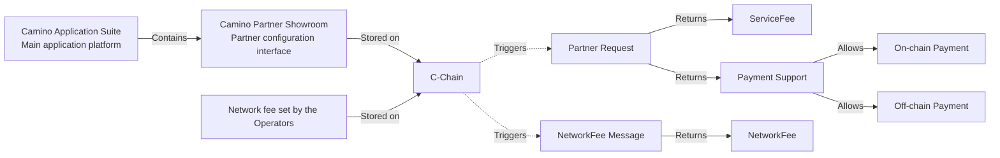

# Camino Messenger Fees

:::warning PENDING UPDATE

The messenger fees explained in this document with EURe stable coin is not
implemented on the smart contracts yet. Currently these fees are paid in CAM but
will be updated to EURe stable coin in near future.

:::

:::info DISCLAIMER

Throughout this document, we assume an exchange rate of 1 CAM = 0.15€. Since CAM is
a freely tradable and volatile cryptocurrency, its value can change at any moment.

:::

The following fees are designed to exchange messages using the Camino Messenger. Their purpose is remuneration for the operators of the messenger network, compensation for processing costs of ever worsening "Look to Book" (LTB) ratios and creating an incentive to make an effort to improve LTB ratios.

1. Camino Messenger Network Fee

   The Network Fee goes towards the operators of the Messenger Servers. The initial fee per message is `0.00005` EURe. The fee is identical on each server on the network and will be decided by Chain4Travel. The network fee is split between the operator (70%) and Chain4Travel (30% for further development). Instead of working with an anonymous messenger server, we encourage suppliers to host their own messenger server to earn the network fee themselves.

   Each message, that means each request and each response, requires the network fee. For example, an OTA (distributor) sends a message request to 10 Accommodation Suppliers, paying `0.0005` EURe (`10` x `0.00005` EURe per message). If seven of them send a response back, each will pay `0.00005` EURe per message.

2. Camino Messenger Service Fee

   The Service Fee is set by the supplier for each individual service. It is specified in EURe and can have any value including 0. Its purpose is an additional income stream, balancing out traffic/processing costs, replacement for booking fees or payment for providing information services. The Service Fee is split between the Supplier (70%) and Chain4Travel (30% for further development).

   Examples for using a Service Fee for a specific message type:

   - Micropayments of services
   - Monetize searches as a compensation of poor look2book ratio
   - Monetize searches as a service for business models where no bookings are made (Caching/Metasearch)
   - Replacement for booking fees
   - Incentivize providing information services

## Fee Flow Architecture

The following diagram illustrates how Service Fees and Network Fees are integrated into the Camino Application Suite:

Figure 1: Service Fee and Network Fee

The Partner and Network messages will be made available to enable automatic detection of changed partners, their settings and fees.

## Booking Fee

When a booking is made, ahead of the Mint message one or more validate messages have
been exchanged. The Network Fee is required for each, so for one cycle of validation
and booking, the Distributor pays for two requests and the supplier for two
responses. With the `0.00005` EURe per message a total of `0.00020` EURe, `0.00010` EURe
each.

The Supplier bot mints the booking token on-chain, which depends on the complexity of the operation and currently is around `0.1` CAM, which is currently circa `0.015` €. The Distributor bot initiates a buy operation after the digital asset was checked if it represents the desired booking. This operation currently costs around `0.03` CAM, which is circa `0.0045` €.

This diagram explains the correlation between a messenger fee and a blockchain transaction fee:

<figure>

<figcaption align = "center">Fig.2: messenger and blockchain fees for a booking</figcaption>
</figure>

Under the standard commercial model, in general, a GDS charges airlines a flat fee for each segment booked through their system, an average of $4-6 per booking segment or $16 per ticket (approx. 2.5 segments). Airlines are also charged for every interaction with the system: ticketing, refunds, and any other executed commands. Altogether, GDS fees can account for up to 25 percent of ticket prices.

Accommodation aggregators often charge a booking fee to both the distributor and the supplier. Sometimes these fees exceed 1€ per booking to each party. Additionally monthly license fees and look-to-book penalties might be charged.

As the partners of the Camino Network also trade on the network, it is in their interest to keep the fees as low as possible. Because Chain4travel does not have the integrations to all their partners and the maintenance thereof, the contribution from the fees will always remain a fraction of the cost of a GDS or aggregator.

## Look to Book

Depending on the integration model and the quality of searches on a distribution platform, an average number of searches is required to achieve one booking. This is called "Look-to-Book" (LTB). It is nowadays mostly expressed as the average number of searches required to make a booking, but in the past it was also expressed as a percentage (1% of searches results to a booking, would be the same as 100 searches required for a booking).

In the below calculation example we compare two scenarios where on average 1000 searches are required for each booking. This is a normal LTB in scenarios of qualified traffic, scenarios where the initial search is handles from cache or scenarios of dynamic packaging where a product is added later in the booking funnel.

In case 1 on the left, only the network fee is considered. The supplier has set the fee for searches to 0 EURe. This is the normal situation in case of a sustainable LTB. In this example, we see that each booking has a cost of circa 0.05€ for the distributor and 0.06€ for the supplier.

On right in case 2, a Supplier fee of `0.0001` EURe is configured, with a purpose to compensate for the network fee that is required to send the search responses by the supplier. In this case, we see that the cost of a booking for the supplier is around 0.15€ for the distributor and the supplier actually has earned circa 0.05€ on the traffic.

Both cases substantially below average cost to GDS or aggregators.

<figure>

<figcaption align = "center">Fig.3: Total search and booking fees idea at a look to book of 1.000 searches to one booking</figcaption>
</figure>

In the following figure, we see an example of a partnership where more searches are required to create one booking. To offset the increased processing cost of a slightly less healthy LTB, the supplier has set a service fee higher than the network fee. Setting such a service does not impact partnerships with a healthy look to book ratio, but for less efficient partnerships, the incentive to optimize becomes important and conclusively there is a reason to look at ways to improve the LTB and reduce the cost for the supplier.

Still the costs to the distributor and supplier are below GDS and aggregator fees even without considering possible LTB penalties.

<figure>

<figcaption align = "center">Fig.4: Total search and booking fees idea at a look to book of 25.000 searches to one booking</figcaption>
</figure>

## Running a Camino Messenger Server

Any partner can run a Messenger Server and earn 70% of the network fee. In the example below, we compute the total cost of a booking for a supplier who also host a Messenger Server. The conclusion that we draw from these examples is that it is attractive for suppliers to run a messenger server and with poorer LTBs it is not required to set high Service Fees to be able to support a larger number of searches per booking. However, the incentive remains to improve LTB for the distributor.

<figure>

<figcaption align = "center">Fig.5: Search and booking fees idea at a look to book of 1.000 searches to one booking, where the supplier hosts a messenger server</figcaption>
</figure>

## How fees are paid and collected

The bot automatically adds a network fee cheque to every message. Cheques are incremental and compute the total amount of network fee for sending all the messages, since installation of the messenger bot. Cheques are unique per sending and receiving CM Account and messenger bot. The cheques are collected by the messenger server and periodically cashed-in. Only the last cheque received will be cashed-in and the on-chain cash-in operation compares the current cash-in amount to the last cash-in operation to compute the difference that is to be collected.

The distributor bot also collects the Service Fee settings upon first sending of a message to a supplier (and periodically afterwards). A Service Fee cheque is always attached, but the collectible value can be set to 0. The Service Fee cheque is also cumulative and sent to the supplier. These Cheques are also unique per Bot, Distributor and Supplier CM Account. In a similar way, the supplier periodically cashes-in the last check received and the on-chain operation pays-out the difference compared to the previous cash-in operation.
